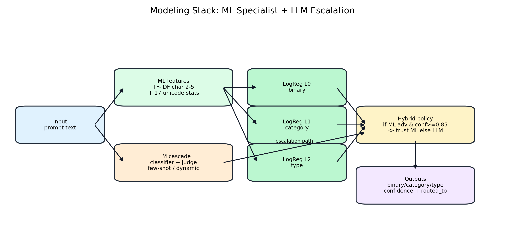

# LLM Security Gatekeeper
### Detect adversarial prompts before they reach production LLMs

- Hierarchical gatekeeper for prompt injection + jailbreak detection
- Value proposition: high attack catch-rate with configurable ML/LLM cost tradeoff
- Repo: `llm-gatekeeping`

---

## The Problem

- We need to classify incoming prompts as `adversarial` vs `benign` before model execution
- Beyond binary blocking, we also want attack category/type signals for analysis and mitigation
- Real impact:
  - Missed attacks (false negatives) become direct security failures
  - Over-blocking benign prompts (false positives) degrades UX and trust

---

## Why It Is Hard

- Adversarial prompts are intentionally obfuscated (unicode tricks, NLP perturbations)
- Distribution shift is severe across external datasets
- Taxonomy challenge:
  - Unicode sub-types are separable
  - NLP sub-types are largely indistinguishable and collapsed
- Practical constraints:
  - LLM inference is costly/slow
  - ML-only can overfit to narrow benign data

---

## High-Level Solution

- Reproducible research pipeline (DVC): preprocess -> split -> ML -> optional LLM -> hybrid -> reports
- Hybrid policy: trust high-confidence ML adversarial predictions; escalate uncertain/benign ML cases

---

## Data: Sources, Splits, and Coverage

| Dataset/Split | Rows | Adversarial | Benign | Adv % |
|---|---:|---:|---:|---:|
| full_dataset | 11,795 | 11,172 | 623 | 94.7% |
| train | 7,633 | 7,197 | 436 | 94.3% |
| val | 1,652 | 1,559 | 93 | 94.4% |
| test | 1,690 | 1,596 | 94 | 94.4% |
| test_unseen (held-out attacks) | 820 | 820 | 0 | 100% |

- External eval sets: deepset (116), jackhhao (262), safeguard (2,049), spml (15,917)

---

## Modeling: Feature Extraction + Models

- ML baseline:
  - TF-IDF char n-grams (2-5, `char_wb`) + handcrafted unicode features
  - Logistic regression models for binary/category/type
- LLM classifier:
  - classifier + judge pattern with few-shot support
  - default CLI run limit is 100 samples unless overridden
- Hybrid router:
  - `ml_confidence_threshold: 0.85`
  - escalate low-confidence or ML-benign cases to LLM

---

## Training and Evaluation Design

- Data construction and split strategy:
  - Benign built from de-duplicated original prompts
  - Grouped split by `prompt_hash` to reduce leakage across variants
  - Held-out attack types for unseen generalization (`Emoji Smuggling`, `Pruthi`)
- Baselines compared:
  - ML (unicode-scope eval)
  - Hybrid (full test split)
  - LLM-only (current artifact covers 100 samples)
- Metrics emphasized:
  - Accuracy, adversarial recall, benign recall, FNR/FPR
  - Category/type metrics + calibration buckets

---

## Results (Main Dataset)

| Mode | n | Accuracy | Adv Recall | Benign Recall | FNR |
|---|---:|---:|---:|---:|---:|
| ML (unicode scope) | 996 | 0.9839 | 0.9867 | 0.9574 | 0.0133 |
| Hybrid | 1,690 | 0.6219 | 0.6034 | 0.9362 | 0.3966 |
| LLM | 100 | 0.7100 | 0.6966 | 0.8182 | 0.3034 |

- Interpretation: ML is very strong in its specialist scope; hybrid/LLM artifacts show security-recall tradeoffs that need retuning.

---

## Results (External Generalization)

| Dataset | n | Accuracy | Adv Recall | Benign Recall | FNR |
|---|---:|---:|---:|---:|---:|
| deepset | 116 | 0.4483 | 0.7500 | 0.1250 | 0.2500 |
| jackhhao | 262 | 0.2672 | 0.0504 | 0.5122 | 0.9496 |
| safeguard | 2,049 | 0.3514 | 0.0324 | 0.4989 | 0.9676 |
| spml | 15,917 | 0.1253 | 0.0494 | 0.4073 | 0.9506 |

- Key takeaway: OOD robustness is currently the largest gap.

---

## Error Analysis: What Fails

- Main split hybrid error pattern: high benign recall but many adversarial misses (high FNR)
- External reports show repeated high-confidence mistakes and calibration drift in high-confidence bins
- Common failure themes in external datasets:
  - Benign roleplay/instruction prompts flagged as adversarial
  - Adversarial jailbreak prompts accepted as benign in several datasets

---

## Ablations and Sensitivity

- Available in repo (historical run): threshold sweep table (`project_plan.md`) showing ML-handled % vs accuracy tradeoff
- Missing in current canonical report set:
  - No consolidated ablation report for latest `reports/research/*` artifacts
  - No controlled dynamic-vs-static few-shot ablation report

**TODO: missing in repo**
- Create `reports/research/ablation_report.md` with:
  - threshold sweep on current artifacts
  - hybrid policy variants
  - few-shot strategy ablation

---

## Production Plan

- Serving architecture:
  - Stage 1 ML gate in-process (low latency)
  - Stage 2 LLM escalation for uncertain cases
  - Policy outputs: `block` / `allow` / `review` using `routed_to`, confidence, and risk thresholds
- Monitoring:
  - online FNR/FPR proxies, escalation rate, confidence drift, class prior drift
  - weekly calibration checks + slice-based audits
- Retraining loop:
  - ingest reviewed false positives/false negatives
  - refresh benign distribution and rerun DVC research pipeline
- Safeguards:
  - strict logging/audit trails
  - fallback if LLM provider unavailable

**TODO: missing in repo**
- Full latency/cost benchmark on the canonical latest pipeline artifacts
- End-to-end production API/policy engine implementation

---

## Lessons Learned + Next Steps

- What worked:
  - Strong ML signal for unicode-focused detection
  - Clean reproducible artifact flow with DVC and markdown reports
- What did not:
  - External generalization is currently weak
  - Hybrid policy/coverage configuration needs tighter evaluation protocol
- Next steps (priority):
  1. Expand benign training diversity and recalibrate
  2. Rerun full-scope LLM + strict hybrid evaluations (no partial-coverage mixing)
  3. Add ablation and production benchmark reports as first-class artifacts

---

## Appendix: Repo Pointers and Caveats

- Canonical latest outputs (per README):
  - `reports/research/eval_report_ml.md`
  - `reports/research/eval_report_hybrid.md`
  - `reports/research/eval_report_llm.md`
  - `reports/research_external/research_external_<dataset>.md`
- Artifact lineage:
  - config: `configs/default.yaml`
  - pipeline graph: `dvc.yaml`
  - merged eval artifact: `data/processed/research/research_test.parquet`
- Caveat:
  - Legacy report files exist under `reports/` root; use `reports/research/` and `reports/research_external/` for current narrative.
