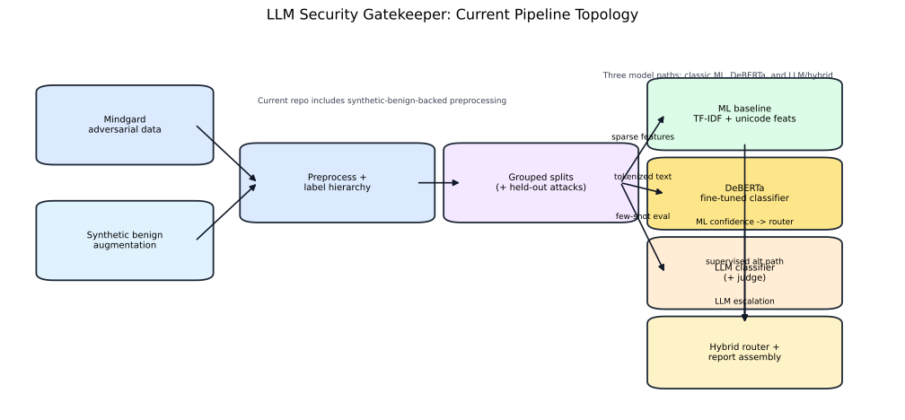
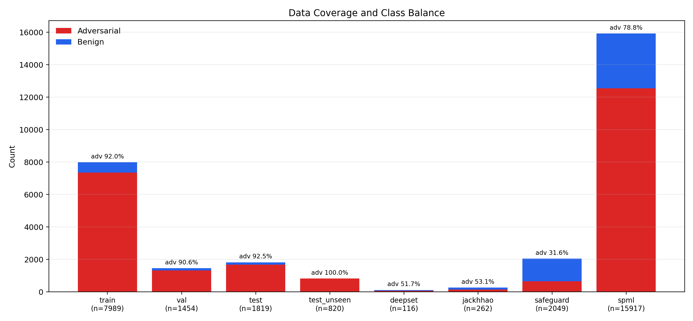
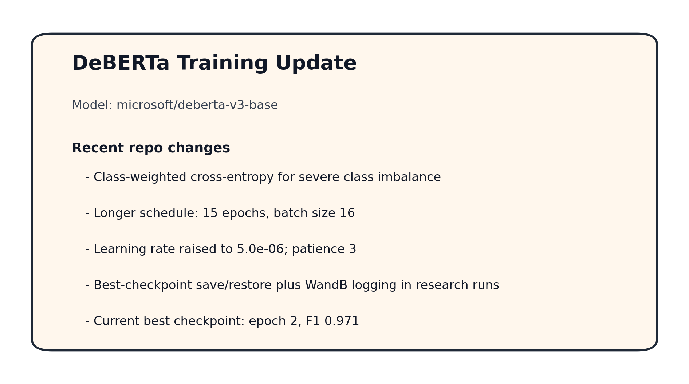
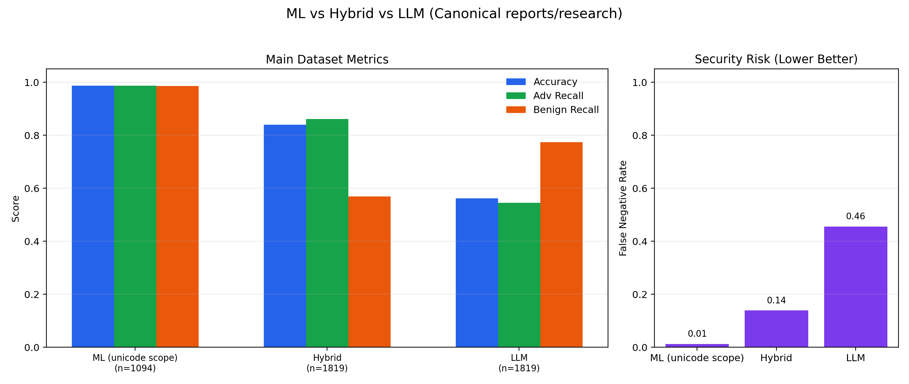
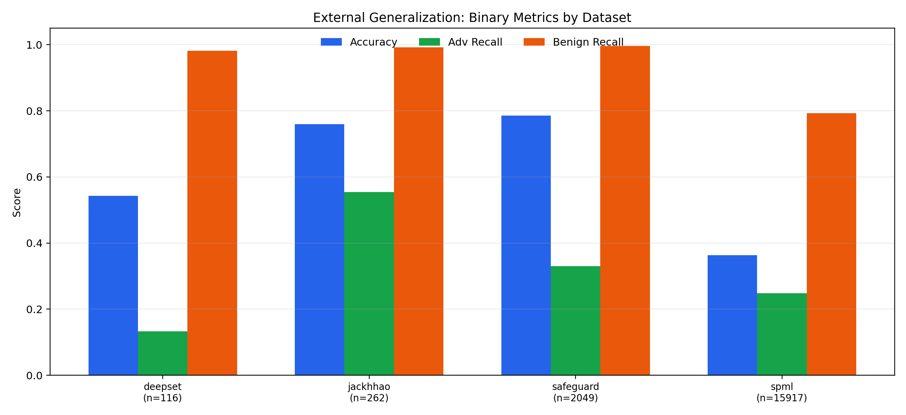
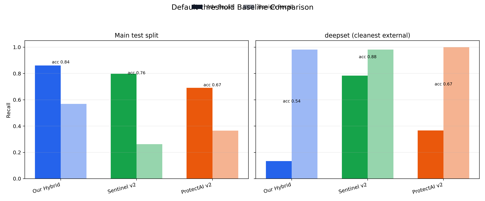
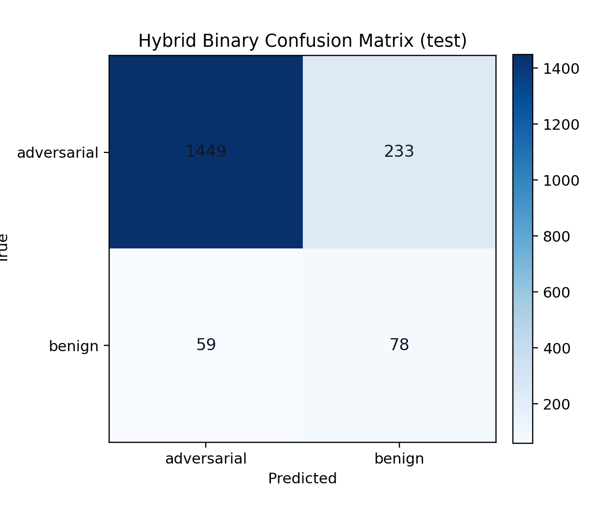

# LLM Security Gatekeeper
### Detect adversarial prompts before they reach production LLMs

- Research pipeline for prompt injection + jailbreak detection
- Current repo state: classic ML, LLM/hybrid routing, DeBERTa fine-tuning, and external baseline benchmarking
- Goal: maximize adversarial catch-rate without making benign UX unusable

---

## The Problem

- We need to classify prompts as `adversarial` vs `benign` before model execution
- Missed attacks are direct security failures
- False positives still matter:
  - they block legitimate user intent
  - they reduce trust in the guardrail
- The project also tracks attack category/type for analysis, not just block/allow

---

## Why This Is Hard

- Attackers deliberately obfuscate prompts:
  - unicode tricks
  - paraphrase / typo / jailbreak variants
- Distribution shift is severe across public external datasets
- The data is highly imbalanced toward adversarial samples
- A production system needs a latency/cost-aware policy, not just one best offline score

---

## Current Pipeline

- DVC pipeline now includes synthetic-benign-backed preprocessing
- After grouped splits, the repo supports three model paths:
  - TF-IDF + unicode-feature ML baseline
  - DeBERTa fine-tuned classifier
  - LLM classifier feeding hybrid routing
- Reports and downstream analysis are artifact-driven

---

## Data Construction and Coverage

| Dataset/Split | Rows | Adversarial | Benign | Adv % |
|---|---:|---:|---:|---:|
| train | 7,989 | 7,352 | 637 | 92.0% |
| val | 1,454 | 1,318 | 136 | 90.6% |
| test | 1,819 | 1,682 | 137 | 92.5% |
| test_unseen | 820 | 820 | 0 | 100.0% |

- Benigns are no longer just de-duplicated originals; synthetic benign data is configured into preprocessing
- Held-out attack types still support unseen-attack testing
- External datasets vary sharply in size and class balance, including a very large `spml` stress set

---

## Modeling Paths

- ML baseline:
  - TF-IDF char n-grams + handcrafted unicode features
  - strong specialist for unicode-heavy attack patterns
- LLM + hybrid:
  - LLM classifier/judge path
  - hybrid router uses ML confidence to decide escalation
- DeBERTa:
  - newer supervised path in the repo for binary classification
  - trained and evaluated through its own DVC stage / CLI

---

## DeBERTa Update

- Recent changes materially improved this path:
  - class-weighted loss for imbalance
  - longer training schedule and larger batches
  - best-checkpoint save/restore
  - research-time WandB logging
- This is an important new repo capability, even though the canonical summary deck is still centered on `reports/research/*`

---

## Main Results From Canonical Reports

| Mode | n | Accuracy | Adv Recall | Benign Recall | FNR |
|---|---:|---:|---:|---:|---:|
| ML (unicode scope) | 1,094 | 0.9872 | 0.9875 | 0.9854 | 0.0125 |
| Hybrid | 1,819 | 0.8395 | 0.8615 | 0.5693 | 0.1385 |
| LLM | 1,819 | 0.5618 | 0.5446 | 0.7737 | 0.4554 |

- Reading this correctly matters:
  - ML is excellent in its specialist scope
  - Hybrid improves attack recall materially over LLM-only
  - The benign side is still the painful tradeoff in the current hybrid setup

---

## External Generalization Is Still The Main Risk

| Dataset | n | Accuracy | Adv Recall | Benign Recall | FNR |
|---|---:|---:|---:|---:|---:|
| deepset | 116 | 0.5431 | 0.1333 | 0.9821 | 0.8667 |
| jackhhao | 262 | 0.7595 | 0.5540 | 0.9919 | 0.4460 |
| safeguard | 2,049 | 0.7857 | 0.3302 | 0.9964 | 0.6698 |

- Even with better current artifacts than the old deck showed, external adversarial recall is still not production-ready
- Generalization remains the core research problem

---

## External Benchmarks Need Caveats

- `deepset` is the cleanest external benchmark in the repo today
- `jackhhao` has small exact overlap with our local corpus and is explicitly a ProtectAI v2 training source
- `safeguard` is not a clean unseen benchmark:
  - Mindgard is documented as Safe-Guard-derived
  - the repo overlap audit found large exact-text overlap
- So external numbers need provenance-aware interpretation, not just leaderboard reading

---

## Baseline Comparison

- The repo now benchmarks against two public models:
  - Sentinel v2
  - ProtectAI v2
- On current checked-in artifacts, our hybrid is stronger on the main test split, while the public baselines are much stronger on `deepset`
- That is useful, not discouraging:
  - it gives us a real target
  - it also forces us to be honest about overlap contamination and benchmark quality

---

## Error Pattern

- On the main test split, the hybrid is still paying for security recall with benign overblocking
- External reports also show calibration mismatch and high-confidence mistakes
- The project has the right plumbing for diagnosis:
  - merged research parquet outputs
  - strict report generation
  - benchmark comparison and overlap audit artifacts

---

## Production View

- The likely serving shape is still two-stage:
  - cheap local classifier first
  - slower escalation only when uncertainty or policy requires it
- The repo already supports many research ingredients needed for production:
  - routing stats
  - calibration analysis
  - reproducible report generation
- Still missing:
  - production API/policy engine
  - full latency/cost benchmarking
  - human review / audit workflow

---

## What Changed Recently

- Synthetic benign generation is now part of the practical data story
- DeBERTa became a real first-party model path rather than an idea
- The project added external HuggingFace baseline comparisons
- The repo also now includes an overlap audit, which changes how to present “external” results responsibly

---

## Next Steps

1. Improve benign realism/diversity and recalibrate routing
2. Push external adversarial recall up on the cleanest benchmark first (`deepset`)
3. Decide whether DeBERTa or a public baseline should become the primary low-latency classifier
4. Add production-facing evaluation: latency, cost, drift, and policy behavior

---

## Appendix: Canonical Sources

- Current narrative should anchor on:
  - `reports/research/summary_report.md`
  - `reports/research/eval_report_{ml,llm,hybrid}.md`
  - `docs/2026-03-13_baseline_dataset_overlap.md`
  - `configs/default.yaml`
  - `dvc.yaml`
- DeBERTa state is backed by:
  - `src/models/deberta_classifier.py`
  - `src/cli/deberta_classifier.py`
  - `artifacts/deberta_classifier/best_checkpoint.json`
